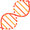

## Description
An attempt to create a set of freely available tools for biological computation written in pure Swift

## Features

- DNA & RNA Sequencing
    - [X] Pattern matching algorithms
    - [X] Reverse Compliment
    - [X] Transcription
    - [X] Translation (into `Protein`)
    - [ ] Ambiguous alphabet support
    - [ ] Probability matching
- Protein
    - [X] Pattern matching algorithms
    - [ ] Ambiguous alphabet support
    - [ ] Probability matching
- IO Support (e.g. support for file formats FASTA, FASTQ, EMBL etc.)
    - [X] FASTA (only unambiguous alphabet)
    - [ ] FASTQ
    - [ ] EMBL
     - Compression
        - [X] [BigIntCompress](https://github.com/valdirunars/bigintcompress)
        - [ ] [MFCompress](http://bioinformatics.ua.pt/software/mfcompress/)

## How To Use
This library is brand new with a lot of features missing, but it's not entirely useless

### Swift Package Manager

```swift
.Package(url: "https://github.com/valdirunars/BioSwift.git", from: "0.0.1")
```

### Sequencing

```swift
var genome: DNAGenome = "AGCTGCTTTGGCGCAATGATCGAGCTGCTTTGGCGCAATGATCGAGCTGCTTTGGCGCAATGATCGAGCTGCTTTGGCGCAATGATCG"
!genome
// "TCGACGAAACCGCGTTACTAGCTCGACGAAACCGCGTTACTAGCTCGACGAAACCGCGTTACTAGCTCGACGAAACCGCGTTACTAGC"

genome.reverseComplement()
// "CGATCATTGCGCCAAAGCAGCTCGATCATTGCGCCAAAGCAGCTCGATCATTGCGCCAAAGCAGCTCGATCATTGCGCCAAAGCAGCT"

genome.indicesOfMinimalSkew(increment: .a, decrement: .t)
// [ 74, 75, 76, 77, 78, 79 ]

genome.mostFrequentPattern(length: 2)
// "GC"

genome = "ACGTTGCATGTCGCATGATGCATGAGAGCT"
genome.mostFrequentPatterns(length: 4, maxDistance: 1)
// [ "GATG", "ATGC", "ATGT" ]

genome = "AGT"
genome.neighbors(maxDistance: 1)
// [ "AGT", "CGT", "TGT", "GGT", "ACT", "AAT", "ATT", "AGA", "AGC", "AGG" ]

let genomes: [DNAGenome] = [
    "CTTTTAGTGGTATTAAGGGTGCCCA",
    "ATTCTAGCCCTATAAGCAATCACTC",
    "GAATGAATATACTCTGACAATATCA",
    "GCTTGCCGGGATTCACACACTATGA",
    "CTGTGTATTAGACGAACTTAAGTCC",
    "CAATATGAGCGTTAGGGAGCTATAA",
    "CGTAGTATGAAAGCGCTCCCTTCCT",
    "ACATTTATAAGGAGTATGGCAGTAG",
    "ATGAGACTCGCACTCTATGATGGCC",
    "ATGGATGCAATATTAGCGGCTAAAT"
]
genomes.motifs(length: 5, maxDistance: 1)
// [ "ATTAT", "TATAA", "TATCA", "TATGA", "TATTA" ]

genome = "AGCATGGGCCCAAACTTTCATAAGCCGGAGCAATGCC"

genome.transcribe()
// RNAGenome("AGCAUGGGCCCAAACUUUCAUAAGCCGGAGCAAUGCC")
genome.transcribe()
// DNAGenome("AGCATGGGCCCAAACTTTCATAAGCCGGAGCAATGCC")

let protein: Protein = genome.translate()
// "MGPNFHKPEQ"

```

### Init sequences from FASTA file

```swift
let fastaURL = URL(string: "../genome.fasta")!
var fastaFileData: Data! = Data(contentsOf: fastaURL)

let genomes: [DNAGenome]? = try! DNAGenome.decode(fastaFileData, type: .fasta)

let proteinFastaURL = URL(string: "../protein.fasta")!
fastaFileData = Data(contentsOf: proteinFastaURL, type: .fasta)

let proteins: [Protein]? = try! Protein.decode(fastaFileData)
```

### Encode sequences to FASTA

```swift
let genome: DNAGenome = "ACGT"
let data: Data? = genome.encode(.fasta)
```

### Compression

```swift
let genome: DNAGenome = "ACGT"
let compressed: Data! = genome.compress(.bigIntCompress)

let decompressed: DNAGenome = DNAGenome.decompress(data: compressed, type: .bigIntCompress)
``
